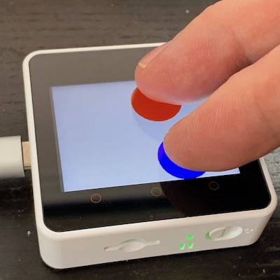

***************
Getting Started
***************

Arduino on M5Stack Core2
========================

You can buy the Core2 device from M5Stack directly, but it's quite popular and lots of distributors and online vendors also have it `in stock <https://www.google.com/search?q=m5stack+core2+buy>`_. Assuming you have the device, follow M5Stack's `instructions <https://docs.m5stack.com/#/en/arduino/arduino_core2_development>`_ for downloading and configuring the Arduino environment for it.

.. note::

    This library is made for the Arduino Integrated Development Environment (IDE) but should also work with the PlatformIO IDE/debugger. If there are specific things to document about getting set up to work with PlatformIO we will do so in a later stage. For now this documentation focusses on the Arduino IDE.
    
Test by compiling one of the examples that come with the 'M5Core2' library (`File / Examples / M5Core2` in the Arduino IDE) to see that everything works as intended before continuing.

Installing Core2ez
==================

Once that works, install Core2ez. At this point in development, this is done by downloading the library directly into the Arduino 'libraries' directory. To do this, open a terminal window and go to the Arduino libraries directory using

``cd ~/Documents/Arduino/libraries``

on MacOS, ``C:\Users\YourName\My Documents\Arduino\libraries`` on Windows or wherever the 'libraries' subdirectory of your Arduino sketches lives on other systems. Once there, enter

``git clone https://github.com/m5ez/Core2ez``

to install the library. Alternatively, you can `download the ZIP file <https://github.com/M5ez/Core2ez/archive/master.zip>`_ and unzip it in the Arduino libraries directory.

To upgrade to the latest development version, open a terminal window, go to the 'libraries/Core2ez' directory and enter ``git pull`` if you used git to download, or repeat the ZIP download from above.

.. note::

    This is only necessary during this phase of development. Once Core2ez has an official release, you'll be able to use the Arduino library manager to install the release version of Core2ez and keep it up to date.

Once Core2ez is installed, you should be able to compile and run the examples provided. To test, try compiling `File / Examples / Core2ez / General / circles` from the Arduino IDE menu and move your fingers across the touch screen. If you see a red circle following your finger, Core2ez is correctly set up.

Don't teach me, show me!
========================

At this point, some may want a structured introduction to programming the Core2 using Core2ez. In that case, skip ahead to the 'Tutorial' section of the documentation. Others might first want to see some examples of what Core2ez can do and then look at the code underneath to see how it's done, learning a lot about Core2ez in the process. Below is a sample of some of the example programs included with Core2ez, and what looking at their code might show you.

circles
-------

``examples/General/circles/circles.ino``

.. literalinclude:: ../examples/General/circles/circles.ino
   :language: c++
   :linenos:

This shows how little code is needed to do a lot with Core2ez. As you see, the library is started with ``ez.begin()``. The ``ezScreen.spriteBuffer()`` sets up a buffer for the entire screen, so that the circles do not flicker when the fingers move. You can set up any screen or part of the screen to have such a buffer, we'll explain that in much detail further on.

The ``ez.update()`` makes sure the all the event stuff that Core2ez does behind the screens is done, and then the code checks whether anything changed with regard to the touch sensor, and draws circles if the touches are present. The ``ezScreen.push()`` tells the system to draw the buffer only after the circles are complete, avoiding flicker.

.. note::

    Note that the touch sensor on the Core2 can handle two touches simultaneously, but only if the fingers are vertically separated. What that means is that two touches next to eachother blend into one touch between the fingers. This is a hardware limitation of the way the sensor is wired up.
