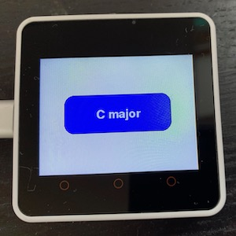
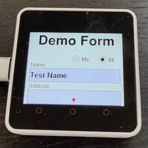
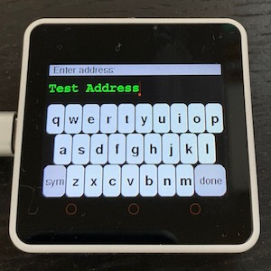
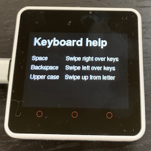

***************
Getting Started
***************

Arduino on M5Stack Core2
========================

You can buy the Core2 device from M5Stack directly, but it's quite popular and lots of distributors and online vendors also have it `in stock <https://www.google.com/search?q=m5stack+core2+buy>`_. Assuming you have the device, follow M5Stack's `instructions <https://docs.m5stack.com/#/en/arduino/arduino_core2_development>`_ for downloading and configuring the Arduino environment for it.

.. note::

    Core2ez is made to work with the Arduino Integrated Development Environment (IDE) but should also work with the PlatformIO IDE/debugger. If there are specific things to document about getting set up to work with PlatformIO we will do so in a later stage. For now this documentation focusses on the Arduino IDE.
    
Test by compiling one of the examples that come with the 'M5Core2' library (`File / Examples / M5Core2` in the Arduino IDE) to see that everything works as intended before continuing.

Installing Core2ez
==================

Once that works, install Core2ez. At this point in development, this is done by downloading the library directly into the Arduino 'libraries' directory, instructions for different operating systems are found below.

.. note::

    This is only necessary during this phase of development. Once Core2ez has an official release, you'll be able to use the Arduino library manager nuilt into the Arduino IDE to install the release version of Core2ez and keep it up to date.

MacOS
-----

To install Core2ez on a Mac, open a terminal window, go to the Arduino libraries directory and use git to get the latest version of Core2ez.

.. code-block:: console

   cd ~/Documents/Arduino/libraries
   git clone https://github.com/m5ez/Core2ez

For later updates, do:

.. code-block:: console

   cd ~/Documents/Arduino/libraries/Core2ez
   git pull
   
Linux
-----

Same as above, but replace ``~/Documents/Arduino/libraries`` with ``~/arduino/libraries``. If you can't find the Arduino sketchbook directory try "File > Preferences > Sketchbook location" in the Arduino IDE menu.

Windows
-------

Windows doesn't come with `git`. Easiest is to `download the ZIP file <https://github.com/M5ez/Core2ez/archive/master.zip>`_ and unpack it such that the Core2ez directory from the zipfile is placed in ``C:\Users\YourName\My Documents\Arduino\libraries``

Once Core2ez is installed, you should be able to compile and run the examples provided. To test, try compiling `File / Examples / Core2ez / General / circles` from the Arduino IDE menu and move your fingers across the touch screen. If you see a red circle following your finger, Core2ez is correctly set up.

Don't teach me, show me!
========================

At this point, some may want a structured introduction to programming the Core2 using Core2ez. In that case, skip ahead to the 'Tutorial' section of the documentation. Others might first want to see some examples of what Core2ez can do and then look at the code underneath to see how it's done, learning a lot about Core2ez in the process. Below is a sample of some of the example programs included with Core2ez, and what looking at their code might show you.

circles
-------

.. image:: images/examples/circles.jpg

``examples/General/circles/circles.ino``

.. literalinclude:: ../examples/General/circles/circles.ino
   :language: c++
   :linenos:

This shows how little code is needed to do a lot with Core2ez. As you see, the library is started with ``ez.begin()``. The ``ezScreen.spriteBuffer()`` sets up a buffer for the entire screen. The ``ezScreen.push()`` tells the system to draw the buffer only after the circles are complete, avoiding flicker when the fingers move. You can set up any screen or part of the screen to have such a buffer, we'll explain that in much detail further on.

The ``ez.update()`` makes sure the all the event stuff that Core2ez does behind the screens is done, and then the code checks whether anything changed with regard to the touch sensor, and draws circles if touches are detected.

.. note::

    Note that the touch sensor on the Core2 can handle two touches simultaneously, but only if the fingers are vertically separated. What that means is that two touches next to eachother blend into one touch between the fingers. This is a hardware limitation of the way the sensor is wired up.

C_major
-------

``examples/Sound/C_major/C_major.ino``

.. literalinclude:: ../examples/Sound/C_major/C_major.ino
   :language: c++
   :linenos:
   
This example will play a C major chord and shows how easy it is to define a widget – a button in this case – to show up on the screen. It also shows the code that will run after the button has been pressed or tapped. (You can also attach events to double-tapping, press-and-hold or dragging of widgets.)

You can also see the three synthesizers being set up to play the three notes that make up the chord, and how the code adds each note and waits a second before adding the next note.

Lastly this shows how events can control everything in Core2ez code: once everything is set up, all the code needs to do is to keep calling ``ez.update()``.

form
----

``examples/General/form/form.ino``

.. literalinclude:: ../examples/General/form/form.ino
   :language: c++
   :linenos:

This is a more complex example. There's a lot going on here: You can see there are many kinds of widgets. Very much like other widget libraries, Core2ez provides text labels, input fields, check boxes and radio buttons next to the buttons as seen in the C_major example above.

As you can see there are many more fields defined than fit on the display. The ``ezScreen.spriteBuffer(320, 500)`` statement sets up a virtual display that is as wide as the physical display (320 pixels), but higher (500 vs. 240 pixels). Core2ez will display the top part of that screen with a little red arrow showing there is more content that the user can scroll to by sliding a finger across the display.

This also shows the text entry functionality built into Core2ez. Any press in a text entry field pops up a keyboard and a text entry field. The "Enter address" prompt alternates with "Swipe down for help" which shows the help screen in the image.

``ezWindow thankyou`` defines a whole new window that can hold different widgets. The ezScreen you've seen a few times now is just an ezWindow that is always set up and that comes up automatically. You can have any number of these and select which one you want to display at any given time while keeping everything on the others in place.

Again, this also shows that once everything is set up, all you need to do is call ``ez.update()`` in the ``loop()`` function and everything will happen when it needs to.